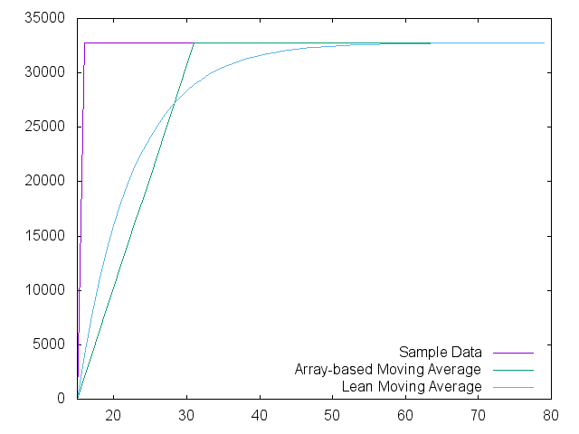
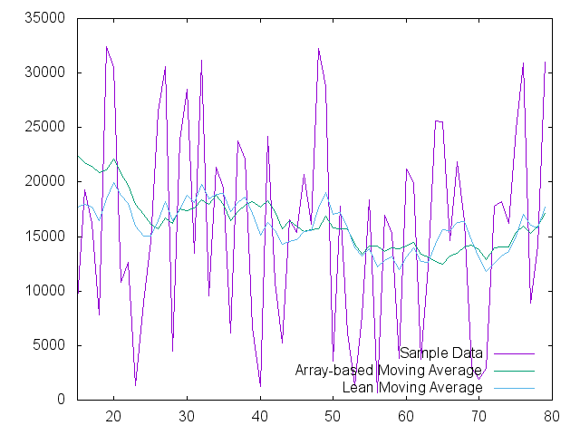
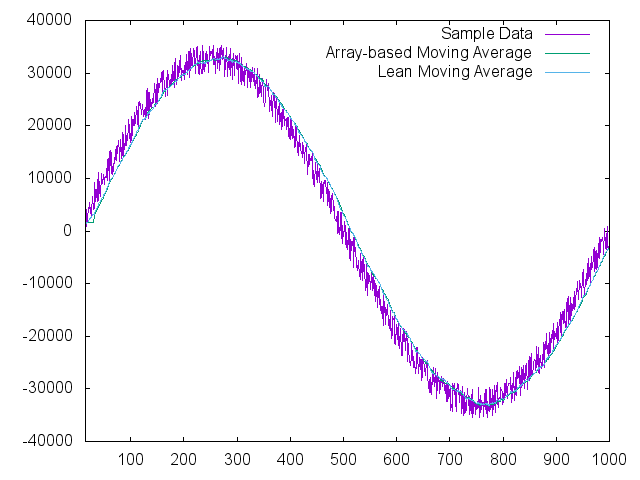

# Purpose

This repository was created as a place to store support files for a low-RAM
moving average technique useful on microcontrollers with limited resources. 
More information may be found at [for(embed)](http://www.forembed.com/a-low-ram-averaging-technique.html).

# Impulse response

# Random Noise

# Noisy Sine Wave

